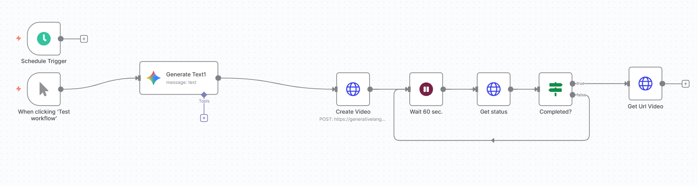

# Generate AI Videos with Google Veo3, Save to Google Drive and Upload to YouTube

This n8n workflow automates the process of generating AI videos using Google Veo3, saving them to Google Drive, and subsequently uploading them to YouTube. The workflow is triggered manually or on a schedule, generates video descriptions using Google Gemini, creates videos via the Veo3 API, waits for video processing, and then downloads the final video.

## Workflow

## 🚀 Features

* **Manual and Scheduled Triggers**: Run the workflow on demand or at predefined intervals.
* **AI Video Description Generation**: Utilizes Google Gemini to create comedic YouTube video descriptions.
* **Google Veo3 Video Creation**: Integrates with the Google Veo3 API to generate videos based on prompts.
* **Asynchronous Video Processing**: Includes a waiting period and status check to ensure video generation is complete.
* **Video URL Retrieval**: Fetches the URL of the generated video for further actions.

## ⚙️ Workflow Overview

The workflow consists of the following nodes:

1.  **When clicking 'Test workflow' / Schedule Trigger**: Initiates the workflow.
2.  **Generate Text1**: Uses Google Gemini to generate a comedic YouTube video description in Hindi, which serves as the prompt for video creation.
3.  **Create Video**: Sends a POST request to the Google Veo3 API to initiate video generation based on the generated text.
4.  **Wait 60 sec.**: Pauses the workflow for 60 seconds to allow time for video processing on the Veo3 side.
5.  **Get status**: Makes a GET request to check the status of the video generation.
6.  **Completed?**: An IF node that checks if the video generation is marked as `done`.
    * If **True**: Proceeds to retrieve the video URL.
    * If **False**: Loops back to "Wait 60 sec." to recheck the status.
7.  **Get Url Video**: Retrieves the URI of the generated video once it's completed.

## 📋 Prerequisites

Before running this workflow, you'll need:

* **n8n Instance**: A running instance of n8n.
* **Google Gemini API Key**: An API key for accessing Google Gemini. This is specified as `GEMINI_API_KEY` in the workflow.
* **Google Cloud Project with Veo3 API Access**: Ensure you have a Google Cloud project with the necessary permissions and API access for Google Veo3.
* **Google Drive Credentials** (not explicitly shown in the provided JSON but implied by the workflow name "Save to Google Drive"): You'll need credentials configured in n8n for Google Drive.
* **YouTube Credentials** (not explicitly shown in the provided JSON but implied by the workflow name "Upload to YouTube"): You'll need credentials configured in n8n for YouTube.

## 🚀 Setup and Usage

1.  **Import the Workflow**:
    * Download the `Generate AI Videos with Google Veo3, Save it locally.json` file.
    * In your n8n instance, go to "Workflows" and click "New".
    * Click on the "Import from JSON" button and paste the content of the downloaded `.json` file, or upload the file directly.

2.  **Configure Credentials**:
    * **Google Gemini**: The `Generate Text1` node uses a credential named "Google Gemini". You'll need to set up a Google Palm API credential in n8n with your Gemini API key.
    * **HTTP Request Nodes**: The `Create Video`, `Get status`, and `Get Url Video` nodes require an `x-goog-api-key` header. Replace `GEMINI_API_KEY` with your actual Google API key (likely the same one used for Gemini, or one with Veo3 access).
    * **Google Drive & YouTube**: Set up your Google Drive and YouTube credentials in n8n as per n8n's documentation. *Note: Nodes for Google Drive and YouTube are not present in the provided JSON, but would be required to fulfill the workflow's stated purpose of saving and uploading.*

3.  **Activate the Workflow**:
    * Once imported and configured, activate the workflow by toggling the "Active" switch in the top right corner of the workflow editor.

4.  **Run the Workflow**:
    * **Manual Trigger**: Click the "Test workflow" button in the "When clicking 'Test workflow'" node to manually run it.
    * **Scheduled Trigger**: The "Schedule Trigger" node is configured to run at intervals (currently set to minutes). Adjust the schedule as needed.

## Troubleshooting

* **API Key Issues**: Double-check that your Google API keys are correctly entered and have the necessary permissions for both Google Gemini and Google Veo3.
* **Video Generation Timeouts**: If videos are not completing, you might need to increase the `Wait 60 sec.` duration or implement more sophisticated retry logic.
* **Missing Google Drive/YouTube Nodes**: If you intend to save to Google Drive and upload to YouTube, you will need to add the appropriate n8n nodes for these services after the "Get Url Video" node and configure them accordingly.

***
